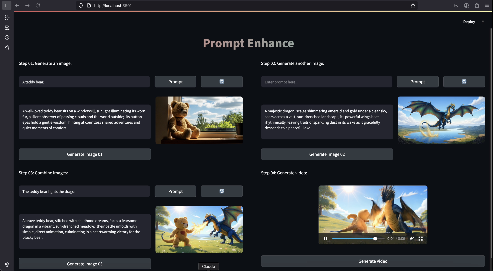

# Promptenhance

Demo video | *Realm of the Kingdom*, a short film created entirely with Promptenhance.

A web app providing a top-down view of the entire process behind video generation.
* Create and image.
* Create another image.
* Combine the two images.
* Create a video using the combined image and the prompt used to create it.



## Setup

Be sure to use a virtual environment:
> ```sh
> $ python3 -m venv venv
> ```
Here, `venv` is just an example, the virtual environment can be given *any* name.

To activate the virtual environment, run the following command:
> ```sh
> $ source venv/bin/activate
> ```

Upon activation, run `pip list`. Only `pip` and `setuptools` should be installed in the virtual environment.

To install requirements, run:
> ```sh
> $ pip install -r requirements.txt
> ```

Create .env:
> ```sh
> $ touch .env
> ```

Create [Fal.ai](https://fal.ai/dashboard) API key [here](https://fal.ai/dashboard/keys).

Add `FAL_KEY="[FAL_KEY]"` to `.env`.

Add `**/.env` to `.gitignore`.

Run the app:
> ```sh
> $ streamlit run app.py
> ```

The app will be live at `http://localhost:8501`.

## To-do

- Add drop-down menus for:
    - Image generation models.
    - Video generation models.
    - Aspect ratio (for both image and video).
    - Add duration option to video.
- Work on a more elaborate frontend. ([Streamlit](https://streamlit.io/) is ideal for prototyping, but not the most presentable):
    - On a related note, refactor the code. As of this writing, the entire app is one `.py` file.
